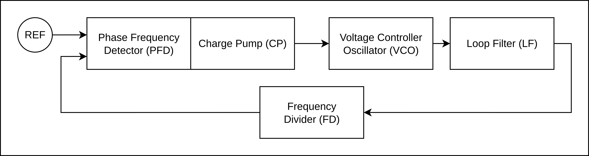

# chipaton2025-mosbius

## Overview

This repository contains the development for the [`SSCS Chipaton 2025`](https://github.com/sscs-ose/sscs-chipathon-2025) project from **Team Prof Morbius**.


## Project Structure

```
Project/
├── VLSI/        # (IC Design Development)
│   ├── layout        # (.mag/.gds files)
│   ├── schematic     # (.sch files)
│   └── design_check  # (drc, lvs, pex files)
└── MOSbius
```

## Quick Links

- **Project**
    - [`Project Timeline`]( https://docs.google.com/spreadsheets/d/1ED5GlzHhh6iyMfWsxwQK_LsvYb5z8FFv7d2K7-hli_0/edit?usp=sharing ) : Timeline for the development
    - [`Project Proposal`]( https://docs.google.com/presentation/d/1d4etSCZGezYiTcyhqJMmxZKgGMZXT_DFGWo_tfqO1z0/edit?usp=sharing ) : Proposal for the Project
- **Other**
    - [`Main Google Drive`]( https://drive.google.com/drive/folders/1l0VH1jhEloeevTNJNOWizoYGq4sh_gAN?usp=sharing ) : The main google drive for this project
    - [`MOSbius.org`]( https://mosbius.org/0_front_matter/intro.html ) : The MOSbius official website

## Blocks

### Blcok Structure
- Blocks in the Chip
    - [ ] PLL Block
        - [ ] Phase Detector
        - [ ] Charge Pump
        - [ ] Loop Filter
        - [ ] VCO Block
    - [ ] UART Block

- Blocks in the MOSBIUS Chip
    - [ ] Mixer
    - [ ] Tunable Divider

### Block Diagrams

- PLL Block Diagram




## References
1.  Liu, Jianghua & Jiang, Jinguang & Tang, Yanan. (2016). A modified closed-loop auto frequency calibration technique for a 1.571-GHz integer-N PLL. International Journal of Electronics. 104. 10.1080/00207217.2016.1253786.  [Link](https://www.researchgate.net/publication/309521542_A_modified_closed-loop_auto_frequency_calibration_technique_for_a_1571-GHz_integer-N_PLL/citation/download)