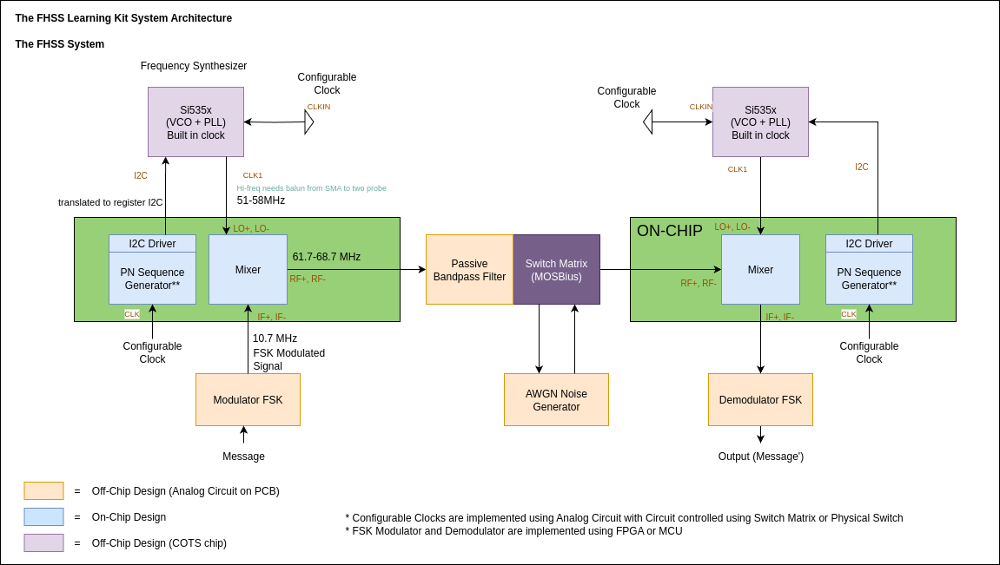

<h1 align=center>
Chipaton - Team Prof Morbius : An FHSS Educational Learning Kit Project
</h1>

## Overview

Welcome to the chipaton2025-mosbius repository!

This repository contains all the design files, documentation, and progress for our Frequency Hopping Spread Spectrum (FHSS) Educational Learning Kit. With this project, we aim to create a hands-on platform for teaching students the system-level principles of spread spectrum communication.

This project is our team's submission for the SSCS Chipathon 2025 (MOSBius Track). We are Team Prof Morbius from the Institute of Technology Bandung, Indonesia.

#### **Team members:**
1. [Leader]	James Patrick <@orpheus016:matrix.org>
2. [Member]	Ibrahim Hanif Mulyana <@ibrhmnhnfm:matrix.org>
3. [Member]	Goldwin Sonick Wijaya Thaha <@goldwinsonick:matrix.org>

## The Project

The goal of this project is to create the **Reconfigurable Mixer** and **PN sequence generator** for a **FHSS Educational Learning Kit**.

The FHSS Educational Learning Kit is a hardware system to learn about FHSS.

</img>

We will focus on designing the IC Layout for the **PN Sequence Generator** and **Mixer** (Green box in the diagram).

## Proposal and Resources

- Our [**Revised Proposal**](https://drive.google.com/file/d/1uSmN1Kq2bPWWUJlL5vvVy811TZmL9LWt/view?usp=sharing) contains the explanation about the project's plan and detail. (The document also contains the detail about the pinlist, block diagrams, and project tracker)

- The full system can be seen on the [**System Architecture Design**](./docs/system_architecture.md) which will includes the on-chip and off-chip system.
