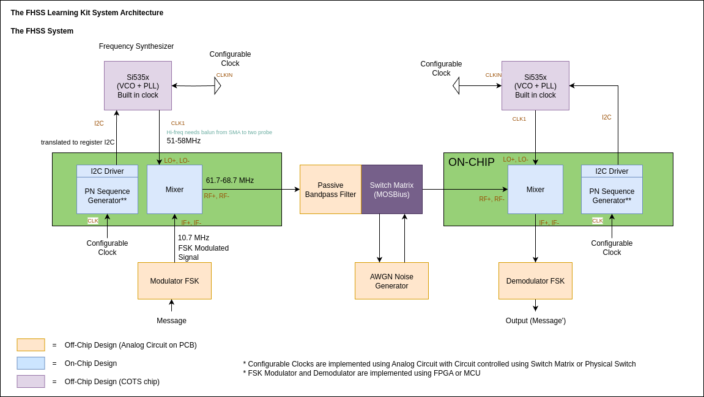

# System Architecture

This page details the high-level hardware design of the FHSS Learning Kit. The system is a hybrid design, combining a custom-designed integrated circuit with commercial off-the-shelf (COTS) components and the versatile MOSBius switch matrix.

    

The learning kit is partitioned into three main implementation domains:

1. **On-Chip (Custom IC)**: Core analog blocks that are fundamental to the learning objectives are designed and implemented in a custom IC. This includes the **PN Sequence Generator** and the **Gilbert Cell Mixer**.

2. **Off-Chip (PCB)**: Supporting systems like the **VCO/PLL**, **FSK modulation**, **FSK demodulation**, and **noise generation** are implemented using COTS components and analog circuits on a central PCB.

3. **MOSBius Playground**: The **MOSBius chip** acts as the central hub and configurable switch matrix, connecting all the blocks and providing a flexible platform for students to reconfigure the system and conduct experiments.