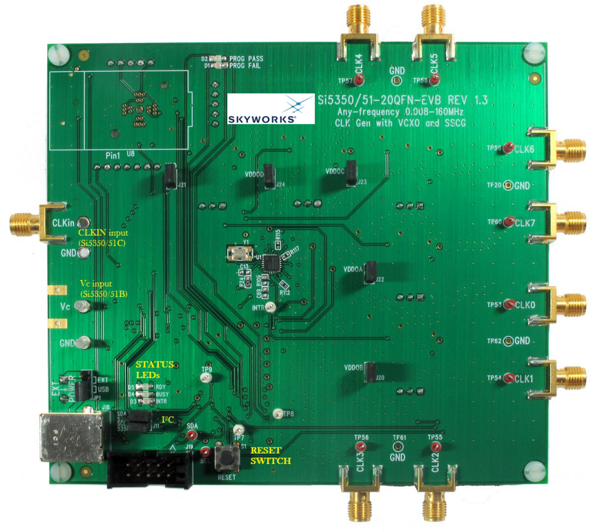

# Off-Chip Systems & PCB Design

The custom IC is supported by several off-chip modules integrated onto a single PCB. These modules provide the necessary signals and functions to complete the FHSS communication link.

## 1. VCO and PLL
- **Function**: Generates the high-frequency local oscillator (LO) signal that is varied by the PN Sequence Generator.

- **Implementation**: We are using a COTS solution with the Si535x evaluation board.
These chips integrate both the VCO and PLL, offering a programmable frequency output (50-100 MHz range) controlled via I2C. This module provides the hopping carrier signal to the mixer.

    

> The main problem with this chip is that it interface with I2C for the Divider Programming.
> We need to convert the PN Sequence Generator to I2C stream.

## 2. FSK Modulator / Demodulator
- **Function**: Handles the modulation of the digital message onto a carrier (FSK) and its subsequent demodulation.

- **Implementation**: Implemented using standard COTS components and analog circuitry on the main PCB. This block processes the 10 MHz IF signal.

> We haven't find the suitable chip exactly for our design. Alternative solution for this would be using a Signal Generator, Implement VCO+Mixer circuit on PCB or FPGA or Microcontroller.

## 3. AWGN Noise Generator
- **Function**: Emulates a noisy transmission channel to demonstrate the robustness of the FHSS system.

- **Implementation**: Implemented as an analog circuit on the PCB.

> TODO: Look for and implement the AWGN Noise Generator Circuit