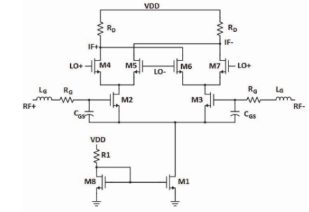

# On-Chip System Design (Custom IC)

The heart of our learning kit is a custom-designed IC containing two critical blocks of the FHSS system.

## 1. PN Sequence Generator

- **Function**: Generates the pseudo-random sequence that dictates the frequency hopping pattern.

- **Implementation**: A 4-bit Linear-Feedback Shift Register (LFSR) is implemented using D-Flip-Flops. This architecture is capable of generating a sequence of 15 unique states, corresponding to 15 different frequency channels. The generator is driven by an external clock, allowing students to control the hopping rate.

    

| Pin   | I/O   | Purpose |
|-------|-------|---------|
| CLK   | Input | **System Clock**    This is the "trigger." to make all the flip-flops change state at the exact same time, keeping the system synchronized. |
| Q₀    | Output| **Main Output**    Output from the flip-flops forming the parallel channel number. |
| Qbar₀ | Output| **"Secondary" Output**    This pin always outputs the exact opposite of the Q pin. Not typically used in a PN Sequence Generator. |

## 2. Gilbert Cell Mixer

- **Function**: Performs frequency translation.
In the transmitter, it upconverts the modulated baseband signal. 
In the receiver, it downconverts the received RF signal.

- **Implementation**:
    - Double-balanced Gilbert Cell mixer is used for its excellent port-to-port isolation and linearity.
    - A key feature of our design is a customizable bias stage.
    An on-chip analog switch allows students to select between a fixed internal current mirror or an external bias circuit that they can design and implement themselves using the MOSBius chip.

    
    

| Pin      | I/O   | Purpose |
|----------|-------|---------|
| LO+, LO- | Input | **Local Oscillator**    The high-frequency hopping carrier from the **VCO**. |
| RF+, RF- | Input/Output | **Radio Frequency**    |
| IF+, IF- | Input/Output | **Intermediate Frequency**    |